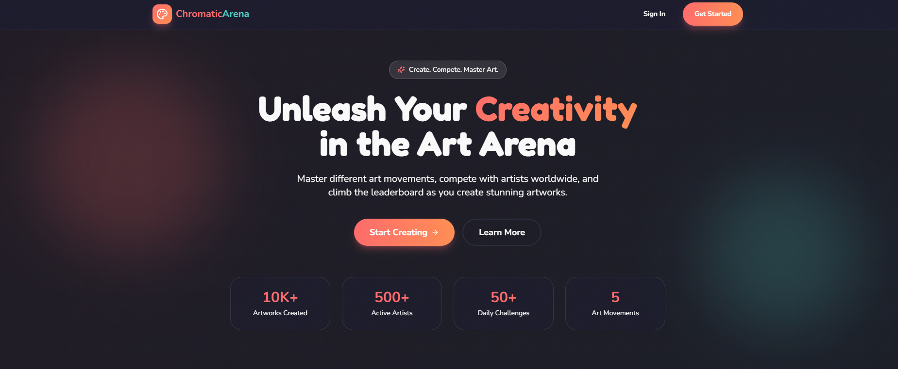
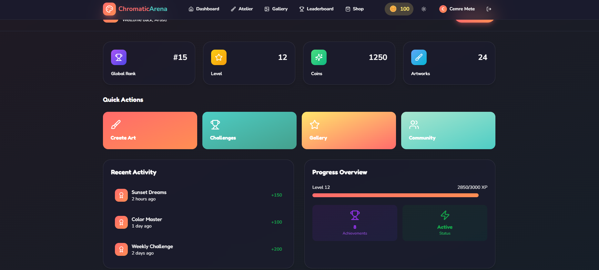
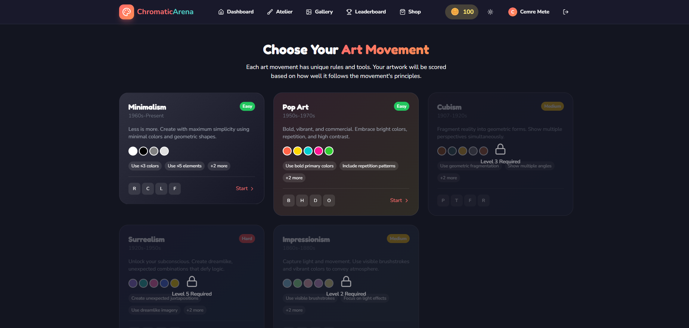
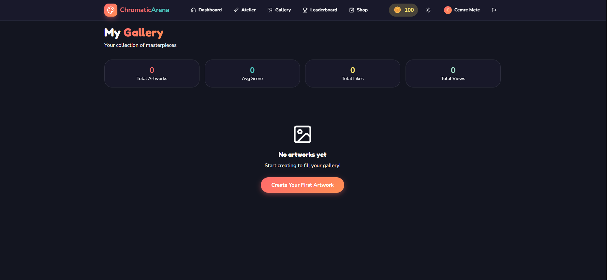
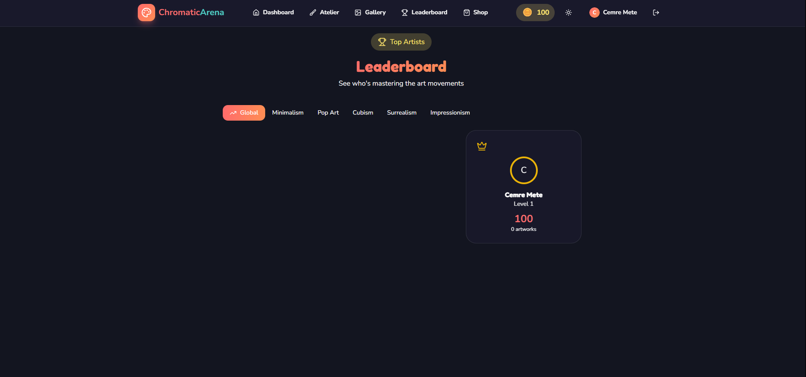

#  Chromatic Arena

**Chromatic Arena** is a gamified art education platform where users learn about iconic art movements by creating artworks and competing on global leaderboards. Master the principles of Minimalism, Pop Art, Cubism, Surrealism, and Impression<<<<<<< HEAD
=======
>>>>>>> c0adb15ism while earning points, unlocking achievements, and climbing the ranks!

---

## ✨ Features

### **Art Creation**
- **Interactive Canvas**: Draw and create artworks using Fabric.js-powered canvas
- **5 Art Movements**: Each with unique rules, color palettes, and scoring criteria
- **Real-time Scoring**: AI-powered feedback based on movement principles
- **Professional Tools**: Brushes, shapes, color palettes, and advanced drawing tools

###**Gamification**
- **Leveling System**: Earn XP and level up by creating artworks
- **Achievements**: Unlock badges for milestones and challenges
- **Leaderboards**: Compete globally or per art movement
- **Virtual Currency**: Earn and spend coins on premium tools and features

###**Educational**
- **Art History**: Learn about each movement's history, key artists, and principles
- **Rule-based Scoring**: Understand what makes each movement unique
- **Instant Feedback**: Get tips to improve your technique

### 🌐 **Social Features**
- **Gallery**: Showcase your artworks to the community
- **User Profiles**: Track your progress and achievements
- **Google OAuth**: Quick and secure login

---

## Tech Stack

### **Frontend**
- **React 19** - UI framework
- **Tailwind CSS** - Styling
- **Fabric.js** - Canvas drawing library
- **Framer Motion** - Animations
- **Radix UI** - Accessible component library
- **Zustand** - State management
- **React Router** - Navigation

### **Backend**
- **FastAPI** - Python web framework
- **MongoDB** - NoSQL database
- **Motor** - Async MongoDB driver
- **JWT** - Authentication
- **Google OAuth 2.0** - Social login
- **Uvicorn** - ASGI server

---

## Installation

### Prerequisites

- **Node.js** 18+ ([Download](https://nodejs.org/))
- **Python** 3.10+ ([Download](https://www.python.org/downloads/))
- **MongoDB** 6.0+ ([Download](https://www.mongodb.com/try/download/community))

### 1️⃣ Clone the Repository

```bash
git clone https://github.com/yourusername/chromatic-arena.git
cd chromatic-arena/chromatic-arena
```

### 2️⃣ Frontend Setup

```bash
# Navigate to frontend
cd frontend

# Install dependencies
npm install

# Create .env file (if not exists)
# REACT_APP_BACKEND_URL=http://localhost:8000
# REACT_APP_GOOGLE_CLIENT_ID=your_google_client_id

# Start development server
npm start
```

Frontend will run on **http://localhost:3000**

### 3️⃣ Backend Setup

```bash
# Navigate to backend (from project root)
cd backend

# Create virtual environment
python -m venv venv

# Activate virtual environment
# Windows:
.\venv\Scripts\Activate.ps1
# macOS/Linux:
source venv/bin/activate

# Install dependencies
pip install -r requirements.txt

# Create .env file (if not exists)
# MONGO_URL=mongodb://localhost:27017
# DB_NAME=chromatic_arena
# JWT_SECRET=your_secret_key
# GOOGLE_CLIENT_ID=your_google_client_id
# GOOGLE_CLIENT_SECRET=your_google_client_secret

# Start MongoDB (separate terminal)
mongod

# Start backend server
uvicorn server:app --reload --port 8000
```

Backend API will run on **http://localhost:8000**

---

## Usage

1. **Start MongoDB** (if not already running):
   ```bash
   mongod
   ```

2. **Start Backend** (Terminal 1):
   ```bash
   cd chromatic-arena/chromatic-arena/backend
   .\venv\Scripts\Activate.ps1  # Windows
   uvicorn server:app --reload
   ```

3. **Start Frontend** (Terminal 2):
   ```bash
   cd chromatic-arena/chromatic-arena/frontend
   npm start
   ```

4. **Open Browser**: Navigate to `http://localhost:3000`

5. **Create Account** or **Sign in with Google**

6. **Start Creating**:
   - Choose an art movement
   - Create your artwork on the canvas
   - Get scored based on movement rules
   - Save to your gallery and earn XP!

---

## 📂 Project Structure

```
chromatic-arena/
├── backend/
│   ├── server.py              # FastAPI application
│   ├── .env                   # Environment variables
│   └── requirements.txt       # Python dependencies
│
└── frontend/
    ├── public/
    │   └── index.html         # HTML template
    ├── src/
    │   ├── components/        # React components
    │   │   ├── canvas/        # Canvas components
    │   │   │   ├── ArtCanvas.js
    │   │   │   └── ScorePanel.js
    │   │   ├── layout/        # Layout components
    │   │   │   └── Navbar.js
    │   │   └── ui/            # Shadcn UI components
    │   ├── pages/             # Page components
    │   │   ├── Landingpage.js
    │   │   ├── AtelierPage.js # Main creation page
    │   │   ├── GalleryPage.js
    │   │   ├── LeaderboardPage.js
    │   │   └── ...
    │   ├── lib/               # Utilities
    │   ├── AuthContext.js     # Authentication context
    │   ├── gameStore.js       # Zustand store
    │   └── App.js             # Root component
    ├── .env                   # Environment variables
    ├── package.json           # Node dependencies
    ├── tailwind.config.js     # Tailwind configuration
    └── craco.config.js        # Create React App config
```

---

## 🎯 Art Movements

| Movement | Era | Difficulty | Key Features |
|----------|-----|------------|--------------|
| **Minimalism** | 1960s-Present | Easy | ≤3 colors, ≤5 elements, geometric shapes |
| **Pop Art** | 1950s-1970s | Easy | Bold colors, repetition, high contrast |
| **Impressionism** | 1860s-1880s | Medium | Visible brushstrokes, light effects, pastels |
| **Cubism** | 1907-1920s | Medium | Geometric fragmentation, multiple perspectives |
| **Surrealism** | 1920s-1950s | Hard | Dreamlike imagery, unexpected juxtapositions |

---

## 🔌 API Endpoints

### Authentication
- `POST /api/auth/register` - Register new user
- `POST /api/auth/login` - Login with email/password
- `GET /api/auth/google` - Initiate Google OAuth
- `GET /api/auth/me` - Get current user
- `POST /api/auth/logout` - Logout user

### Art Movements
- `GET /api/movements` - Get all art movements
- `GET /api/movements/{movement_id}` - Get specific movement

### Artworks
- `POST /api/artworks` - Create new artwork
- `GET /api/artworks/gallery/{user_id}` - Get user's gallery
- `POST /api/score/calculate` - Calculate artwork score

### Shop & Inventory
- `GET /api/shop/tools` - Get available tools
- `POST /api/shop/purchase/{tool_id}` - Purchase tool
- `GET /api/shop/inventory` - Get user inventory

### Leaderboard
- `GET /api/leaderboard/global` - Global rankings
- `GET /api/leaderboard/movement/{movement_id}` - Movement-specific rankings

### Achievements
- `GET /api/achievements/user/{user_id}` - Get user achievements

---

## Scoring System

Each art movement has specific scoring criteria:

### Example: Minimalism
- **Colors (30 pts)**: Use ≤3 colors
- **Elements (30 pts)**: Use ≤5 elements
- **Negative Space (25 pts)**: Maintain ≥40% empty space
- **Geometric Bonus (15 pts)**: Use only geometric shapes

**Total**: Up to 150 points per artwork

---

## 📸 Application Preview

<div align="center">

### Main Features Showcase

<table>
  <tr>
    <td>
      <h3>🏠 Landing Page</h3>
      
      <p>Engaging landing page with statistics and clear call-to-action buttons</p>
    </td>
  </tr>
  <tr>
    <td>
      <h3>📊 User Dashboard</h3>
      
      <p>Comprehensive dashboard showing rank, level, coins, artworks, and recent activity</p>
    </td>
  </tr>
  <tr>
    <td>
      <h3>🎨 Art Movement Selection</h3>
      
      <p>Interactive cards for each art movement with difficulty indicators and unlock requirements</p>
    </td>
  </tr>
  <tr>
    <td>
      <h3>🖼️ Personal Gallery</h3>
      
      <p>Beautiful gallery view with statistics: total artworks, average score, likes, and views</p>
    </td>
  </tr>
  <tr>
    <td>
      <h3>🏆 Global Leaderboard</h3>
      
      <p>Competitive ranking system with podium display for top 3 artists</p>
    </td>
  </tr>
</table>

</div>
=======

## 🔐 Environment Variables

### Frontend (.env)
```env
REACT_APP_BACKEND_URL=http://localhost:8000
REACT_APP_GOOGLE_CLIENT_ID=your_google_client_id_here
WDS_SOCKET_PORT=443
ENABLE_HEALTH_CHECK=false
```

### Backend (.env)
```env
MONGO_URL=mongodb://localhost:27017
DB_NAME=chromatic_arena
CORS_ORIGINS=http://localhost:3000,http://localhost:5173
JWT_SECRET=your_jwt_secret_key_here

GOOGLE_CLIENT_ID=your_google_client_id_here
GOOGLE_CLIENT_SECRET=your_google_client_secret_here
GOOGLE_REDIRECT_URI=http://localhost:8000/api/auth/google/callback

FRONTEND_URL=http://localhost:3000
```

---

## Troubleshooting

### Port Already in Use
```bash
# Windows - Kill process on port 3000
netstat -ano | findstr :3000
taskkill /PID <PID> /F

# macOS/Linux
lsof -ti:3000 | xargs kill
```

### MongoDB Connection Error
- Ensure MongoDB is running: `mongod`
- Check connection string in `.env`

### Module Not Found
```bash
# Frontend
cd frontend && npm install

# Backend
cd backend && pip install -r requirements.txt
```

### CORS Errors
- Check `CORS_ORIGINS` in backend `.env`
- Ensure frontend URL matches

---

## Contributing

Contributions are welcome! Please follow these steps:

1. Fork the repository
2. Create a feature branch (`git checkout -b feature/AmazingFeature`)
3. Commit your changes (`git commit -m 'Add some AmazingFeature'`)
4. Push to the branch (`git push origin feature/AmazingFeature`)
5. Open a Pull Request


---

## Acknowledgments

- **Fabric.js** for the amazing canvas library
- **FastAPI** for the modern Python framework
- **Radix UI** for accessible components
- **Tailwind CSS** for beautiful styling
- Art history resources from various museums and educational institutions

---

## 🌟 Support

If you like this project, please give it a ⭐ on GitHub!

For questions or support, please open an issue on the [GitHub repository](https://github.com/cemremete/chromatic-arena/issues).


